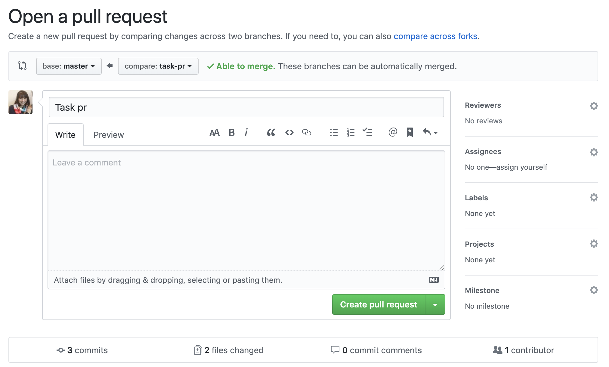

# 1. Implement Product Details Page

Implement the Product modal as shown in the Figma design file: https://www.figma.com/file/ddnRArsK0ZT4CmmQvLvJTh/Code-Assessment.

Requirements:

- Users should be able to open the product modal from both the homepage and Cart modal, or navigate to a route in the format `/product/:productId`
- Clicking on the product name or image should open the product modal
- Closing the Product modal should take the user to the homepage, no matter where they came from
- Implement the PDP image picker, so clicking on a thumbnail changes the featured image (no animation/transition between images is required)
- Don't worry about wiring up quantity/Add to Bag buttons
- No specific loading/404 behavior is required, as long as these events do not lead to an error

# 2. Implement a State Management Library

Replace our use of React Context with the state management library of your choice (Apollo, Redux, MobX, urql, etc). While you’re at it, please wire up two API integrations. You may choose between GraphQL or REST.

1. Fetch products on app load via `products` GraphQL resolver or `/products` endpoint
2. Calculate cart totals via `cart` GraphQL resolver or `/cart` endpoint

See https://github.com/workco/code-assessment-api for more API documentation.

Requirements:

- Shipping should display "FREE" when the total shipping cost is $0.

# 3. Improve Cart Modal's Accessibility

Implement a focus trap for the modal to improve accessibility for keyboard users. Please do not use a third-party library for this task.

Requirements:

- Focus on first focusable item in modal on modal open
- On tab off last item, focus on first focusable item
- On shift-tab off first item, focus on last focusable item
- Never lose focus if focused element is removed from modal

# 4. Improve Tests

Complete the following objectives:

1. Update the useAppContext hook or its test to resolve the warning that appears when running tests.
2. Implement the two skipped tests in the useAppContext test.
3. Make one additional change to improve test coverage in the repo.
4. In your PR for this task, propose a strategy for improving coverage. Explain your thinking and any potential tradeoffs of this approach.

# 5. Review Pull Request

This task requires a little setup on your end. Please create a pull request between the `main` and `branch-for-task-5` branches. Don’t worry about the description - just press “Create pull request” from a screen like this.

Now, please review this PR as if you were reviewing a colleague’s code.

For context, imagine the author of this PR is an engineer who is new to React and has one year of development experience. The PR is fulfilling an imaginary JIRA ticket called “Add Cart Animation on Opening/Closing.”

# 6. Disable Add/Increment Based on Inventory

Right now, products can be added or incremented regardless of inventory. Please update the codebase so that the product inventories never go below 0.

Requirements:

- Out of stock product button is disabled on homepage
- Out of stock increment button is disabled in cart

# 7. Enhance Component Stories

This repo uses [Storybook](https://storybook.js.org/). Run `yarn storybook` to start a local instance at http://localhost:5000.

Complete the following objectives:

1. Each component has a stories file, but only one configuration is covered. (Knobs are fun, but they don't count as separate configurations.) Please update stories as needed to reflect all significant configurations of each component.
2. Find a way to create stories for the `Cart` screen.

# 8. Create Your Own!

Define and complete your own task 💪. Use this opportunity to show us how you like to set up your React projects and/or demonstrate more of your skills.
