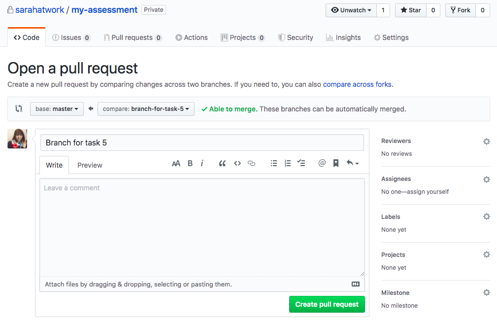

# 1. Implement Product Details Page - Level III

Implement the Product modal as shown in the Figma design file: https://www.figma.com/file/TghrEZgi3nl3t3iZ72Ufmt/Code-Assessment---Final.

Requirements:

- Users should be able to open the product modal from both the homepage and Cart modal, or navigate to a route in the format `/product/:productId`
- Closing the Product modal should take the user to the homepage, no matter where they came from
- No animation is required when switching between active images in the PDP image picker
- Don't worry about wiring up quantity/add to bag buttons
- Our data contains some placeholder.com images for certain image types - this is expected
- No specific loading/404 behavior is required, as long as these events do not lead to an error

# 2. Implement a State Management Library - Level III

Replace our use of React Context with the state management library of your choice (Apollo, Redux, MobX, urql, etc). While you’re at it, please wire up two API integrations. You may choose between GraphQL or REST.

1. Fetch products on app load via `products` GraphQL resolver or `/products` endpoint
2. Calculate cart totals via `cart` GraphQL resolver or `/cart` endpoint

See https://github.com/workco/code-assessment-api for more API documentation.

Requirements:

- Shipping should display "FREE" when the total shipping cost is $0.

# 3. Improve Cart Modal's Accessibility - Level II

Implement a focus trap for the modal to improve accessibility for keyboard users. Please also implement any other quick wins you can think of to improve the accessibility of the modal.

Please do not use a third-party library for this task.

Requirements:

- Focus on first focusable item in modal on modal open
- On tab off last item, focus on first focusable item
- On shift-tab off first item, focus on last focusable item
- Never lose focus if focused element is removed from modal
- One other accessibility improvement to cart modal

# 4. Improve Tests - Level II

Complete the following objectives:

A. Update the useAppContext hook or its test to resolve the warning that appears when running tests.
B. Implement the two skipped tests in the useAppContext test.
C. Make one additional change to improve test coverage in the repo.
D. In your PR for this task, propose a strategy for improving coverage. Explain your thinking and any potential tradeoffs of this approach.

# 5. Review Pull Request - Level II

This task requires a little set up on your end. Please create a pull request between the `master` and `task-pr` branches. Don’t worry about the description - just press “Create pull request” from a screen like this.

Now, please review this PR as if you were reviewing a colleague’s code.

For context, imagine the author of this PR is an engineer who is new to React and has one year of development experience. The PR is fulfilling an imaginary JIRA ticket called “Add Cart Animation on Opening/Closing.”
